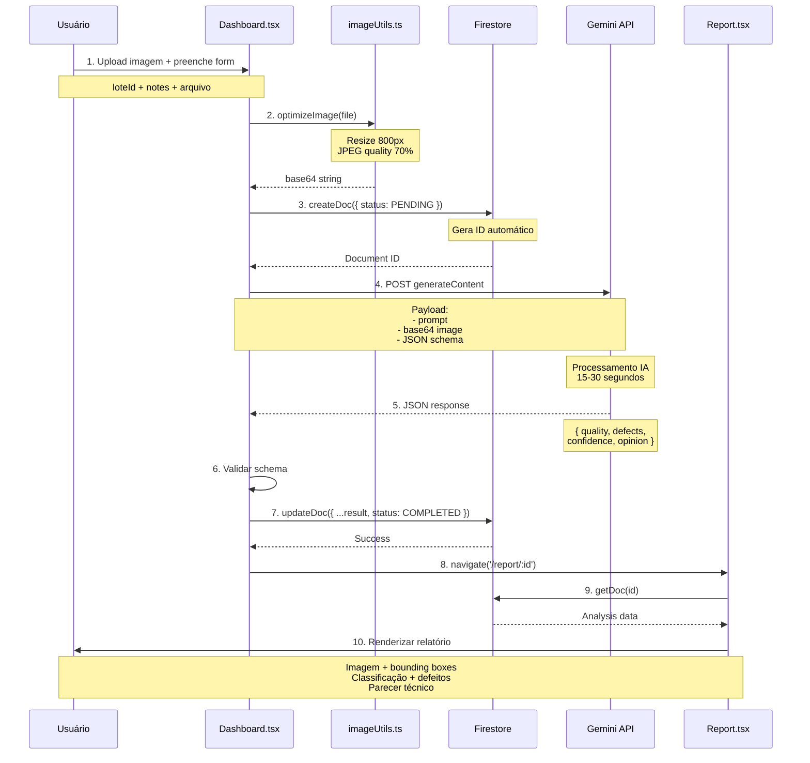
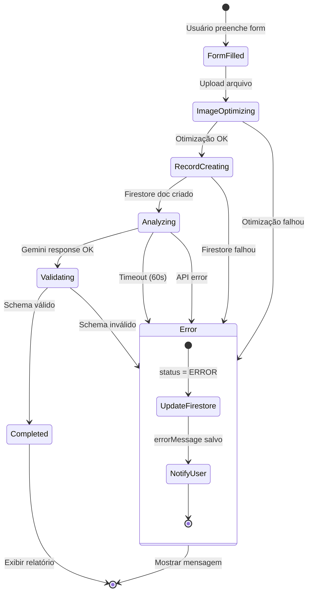
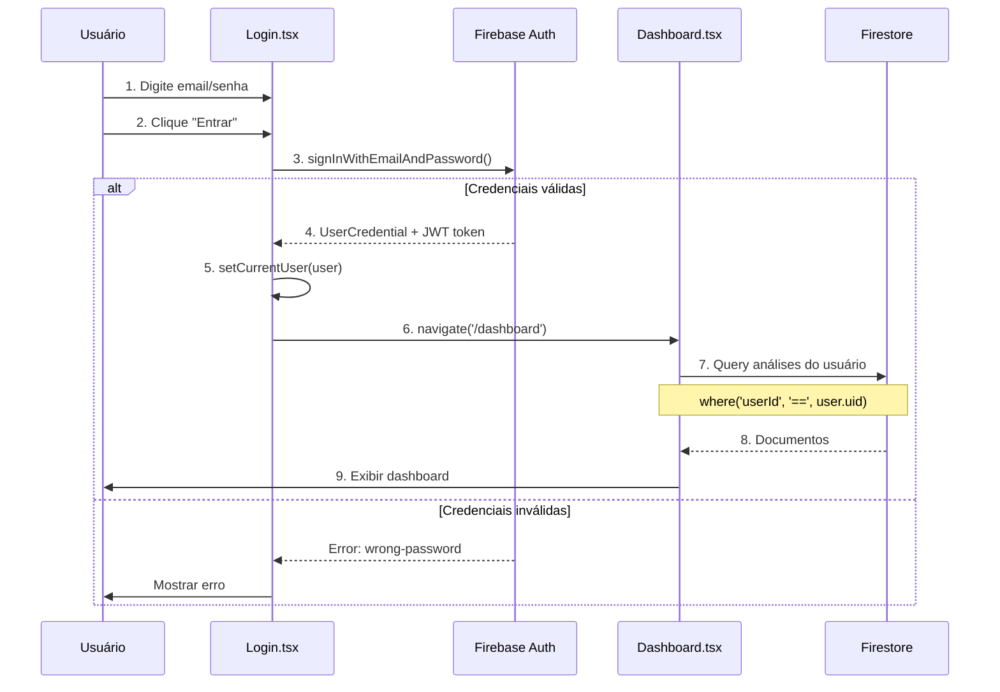
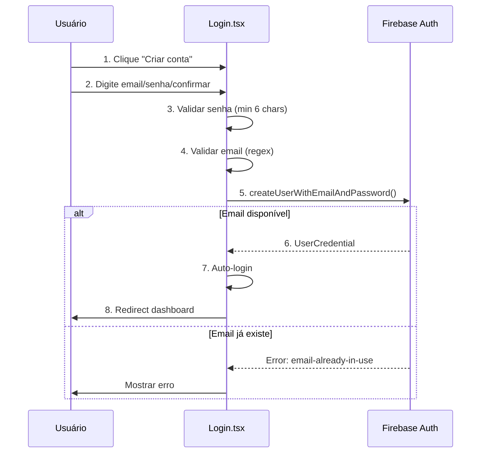
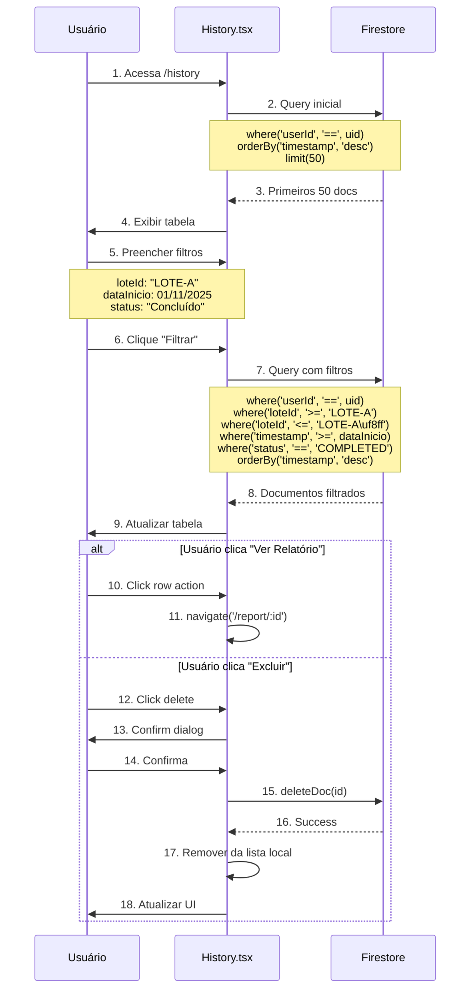
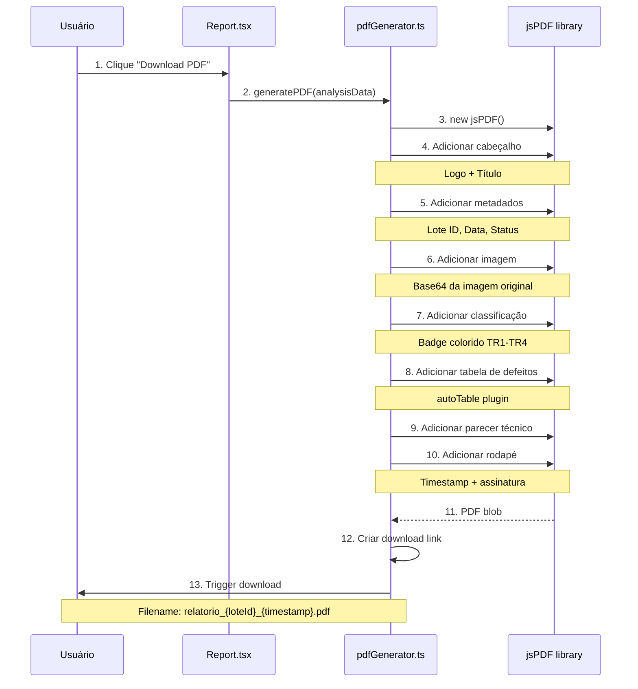
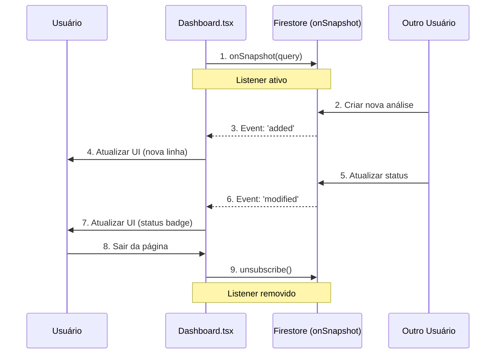
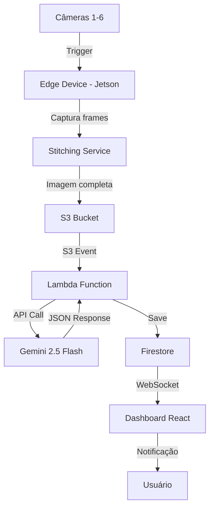

# Fluxo de Dados - LeatherAI

## 1. Visão Geral

Este documento detalha os fluxos de dados da aplicação LeatherAI, desde a interação do usuário até a persistência e exibição de resultados.

---

## 2. Fluxo Principal: Análise de Couro (Happy Path)

### 2.1 Diagrama de Sequência



### 2.2 Fluxo Textual Detalhado

**Etapa 1-2: Preparação da Imagem**
```typescript
// Usuário seleciona arquivo
const file = event.target.files[0];

// Sistema valida
if (!file.type.startsWith('image/')) {
  throw new Error('Arquivo deve ser imagem');
}

// Otimiza imagem
const base64 = await optimizeImage(file);
// Reduz de ~5MB para ~500KB
```

**Etapa 3: Criação do Registro**
```typescript
const docRef = await addDoc(collection(db, 'leatherAnalysis'), {
  userId: currentUser.uid,
  loteId: formData.loteId,
  notes: formData.notes,
  imageUrl: base64,
  status: 'PENDING',
  timestamp: serverTimestamp()
});
// Retorna: docRef.id = "abc123..."
```

**Etapa 4-5: Análise IA**
```typescript
const model = genai.GenerativeModel('gemini-2.5-flash');
const result = await model.generateContent([
  PROMPT_COMPLETO,
  { inlineData: { mimeType: 'image/jpeg', data: base64 }}
]);

// Gemini retorna JSON estruturado
const analysis = JSON.parse(result.response.text());
```

**Etapa 6-7: Atualização do Resultado**
```typescript
await updateDoc(docRef, {
  ...analysis,  // quality, defects, confidence, opinion
  status: 'COMPLETED',
  processingTime: Date.now() - startTime
});
```

**Etapa 8-10: Exibição**
```typescript
navigate(`/report/${docRef.id}`);

// Report.tsx busca dados
const doc = await getDoc(doc(db, 'leatherAnalysis', id));
const data = doc.data();

// Renderiza UI com React
```

---

## 3. Fluxo de Erro: Análise com Falha

### 3.1 Diagrama de Estados



### 3.2 Tratamento de Erros

**Erro 1: Otimização de Imagem**
```typescript
try {
  const base64 = await optimizeImage(file);
} catch (error) {
  setError('Falha ao processar imagem. Tente outro formato.');
  return;
}
```

**Erro 2: Timeout Gemini API**
```typescript
const controller = new AbortController();
const timeoutId = setTimeout(() => controller.abort(), 60000);

try {
  const result = await model.generateContent(
    [...],
    { signal: controller.signal }
  );
} catch (error) {
  if (error.name === 'AbortError') {
    await updateDoc(docRef, {
      status: 'ERROR',
      errorMessage: 'Timeout: Análise demorou mais de 60s'
    });
  }
}
```

**Erro 3: Schema Inválido**
```typescript
const analysis = JSON.parse(result.response.text());

// Validar campos obrigatórios
if (!analysis.quality || !analysis.defects) {
  throw new Error('Resposta da IA incompleta');
}

// Validar enums
const validQualities = ['TR1', 'TR2', 'TR3', 'TR4', 'R'];
if (!validQualities.includes(analysis.quality)) {
  throw new Error('Classificação inválida');
}
```

---

## 4. Fluxo de Autenticação

### 4.1 Diagrama de Sequência - Login



### 4.2 Fluxo de Registro



### 4.3 Proteção de Rotas

```typescript
// PrivateRoute.tsx
function PrivateRoute({ children }) {
  const { currentUser, loading } = useAuth();
  
  if (loading) {
    return <LoadingSpinner />;
  }
  
  return currentUser ? children : <Navigate to="/login" />;
}

// App.tsx
<Routes>
  <Route path="/login" element={<Login />} />
  
  <Route path="/" element={
    <PrivateRoute>
      <Dashboard />
    </PrivateRoute>
  } />
  
  <Route path="/report/:id" element={
    <PrivateRoute>
      <Report />
    </PrivateRoute>
  } />
  
  {/* ... outras rotas protegidas */}
</Routes>
```

---

## 5. Fluxo de Histórico e Filtros

### 5.1 Diagrama de Sequência



### 5.2 Lógica de Filtros

```typescript
// História.tsx
const applyFilters = async () => {
  let q = query(
    collection(db, 'leatherAnalysis'),
    where('userId', '==', currentUser.uid)
  );
  
  // Filtro por loteId (busca parcial)
  if (filters.loteId) {
    q = query(q, 
      where('loteId', '>=', filters.loteId),
      where('loteId', '<=', filters.loteId + '\uf8ff')
    );
  }
  
  // Filtro por intervalo de datas
  if (filters.dataInicio) {
    q = query(q, where('timestamp', '>=', filters.dataInicio));
  }
  if (filters.dataFim) {
    q = query(q, where('timestamp', '<=', filters.dataFim));
  }
  
  // Filtro por status
  if (filters.status && filters.status !== 'TODOS') {
    q = query(q, where('status', '==', filters.status));
  }
  
  // Ordenação e limite
  q = query(q, 
    orderBy('timestamp', 'desc'),
    limit(50)
  );
  
  const snapshot = await getDocs(q);
  const results = snapshot.docs.map(doc => ({
    id: doc.id,
    ...doc.data()
  }));
  
  setAnalyses(results);
};
```

---

## 6. Fluxo de Geração de PDF

### 6.1 Diagrama de Sequência



### 6.2 Código de Geração

```typescript
// pdfGenerator.ts
import jsPDF from 'jspdf';
import 'jspdf-autotable';

export async function generatePDF(analysis: LeatherAnalysis) {
  const doc = new jsPDF();
  
  // Cabeçalho
  doc.setFontSize(20);
  doc.text('LeatherAI - Relatório de Análise', 105, 20, { align: 'center' });
  
  // Metadados
  doc.setFontSize(12);
  doc.text(`Lote: ${analysis.loteId}`, 20, 40);
  doc.text(`Data: ${formatDate(analysis.timestamp)}`, 20, 50);
  doc.text(`Classificação: ${analysis.quality}`, 20, 60);
  
  // Imagem (reduzida)
  const imgData = analysis.imageUrl;
  doc.addImage(imgData, 'JPEG', 20, 70, 170, 100);
  
  // Tabela de defeitos
  doc.autoTable({
    startY: 180,
    head: [['Defeito', 'Severidade', 'Localização']],
    body: analysis.defects.map(d => [
      d.name,
      d.severity,
      d.location
    ])
  });
  
  // Parecer técnico
  const finalY = doc.lastAutoTable.finalY + 10;
  doc.setFontSize(10);
  doc.text('Parecer Técnico:', 20, finalY);
  doc.text(analysis.technical_opinion, 20, finalY + 10, {
    maxWidth: 170
  });
  
  // Rodapé
  doc.setFontSize(8);
  doc.text(
    `Gerado em ${new Date().toLocaleString('pt-BR')}`,
    105,
    280,
    { align: 'center' }
  );
  
  // Download
  doc.save(`relatorio_${analysis.loteId}_${Date.now()}.pdf`);
}
```

---

## 7. Fluxo Real-Time (Planejado V1.1)

### 7.1 WebSocket Updates



### 7.2 Implementação

```typescript
// History.tsx (V1.1)
useEffect(() => {
  const q = query(
    collection(db, 'leatherAnalysis'),
    where('userId', '==', currentUser.uid),
    orderBy('timestamp', 'desc')
  );
  
  const unsubscribe = onSnapshot(q, (snapshot) => {
    snapshot.docChanges().forEach((change) => {
      if (change.type === 'added') {
        // Nova análise criada
        setAnalyses(prev => [
          { id: change.doc.id, ...change.doc.data() },
          ...prev
        ]);
      }
      if (change.type === 'modified') {
        // Análise atualizada (ex: PENDING → COMPLETED)
        setAnalyses(prev => prev.map(a => 
          a.id === change.doc.id 
            ? { id: change.doc.id, ...change.doc.data() }
            : a
        ));
      }
      if (change.type === 'removed') {
        // Análise deletada
        setAnalyses(prev => prev.filter(a => a.id !== change.doc.id));
      }
    });
  });
  
  // Cleanup
  return () => unsubscribe();
}, [currentUser]);
```

---

## 8. Métricas de Performance dos Fluxos

### 8.1 Tempos Médios (Target vs Atual)

| Fluxo | Target | Atual (MVP) | Status |
|-------|--------|-------------|--------|
| Login | < 1s | 0.8s | ✅ |
| Upload + Otimização | < 2s | 1.5s | ✅ |
| Análise IA (E2E) | < 30s | 15-25s | ✅ |
| Carregar histórico (50 docs) | < 1s | 0.6s | ✅ |
| Gerar PDF | < 3s | 2s | ✅ |
| Aplicar filtros | < 500ms | 300ms | ✅ |

### 8.2 Monitoramento (V1.1)

```typescript
// Instrumentação de performance
import { getPerformance } from 'firebase/performance';

const perf = getPerformance(firebaseApp);

// Medir análise E2E
const trace = perf.trace('leather_analysis');
trace.start();

try {
  await analyzeLeather(image, loteId);
  trace.putAttribute('quality', result.quality);
  trace.putMetric('confidence', result.confidence_level);
} finally {
  trace.stop();
}
```

---

## 9. Fluxo de Dados - Vision Pipeline V2.0 (Futuro)

### 9.1 Arquitetura Edge + Cloud



### 9.2 Fluxo Detalhado

```
1. Couro entra na esteira
2. Encoder detecta movimento (a cada 10cm)
3. Trigger dispara captura simultânea (6 câmeras)
4. Edge Device:
   a. Recebe 6 frames (1920x1200 cada)
   b. Stitching em tempo real (~500ms)
   c. ROI detection (cortar background)
   d. Compressão JPEG 85%
5. Upload para S3 (~2-5s para 15-30MB)
6. Lambda triggered:
   a. Download imagem
   b. Chamar Gemini API
   c. Parse resultado
   d. Salvar Firestore
7. WebSocket notifica dashboard
8. Usuário vê resultado em tempo real
```

---

**Versão**: 1.0  
**Última Atualização**: 04/12/2025  
**Mantido por**: Anderson Miranda das Neves
